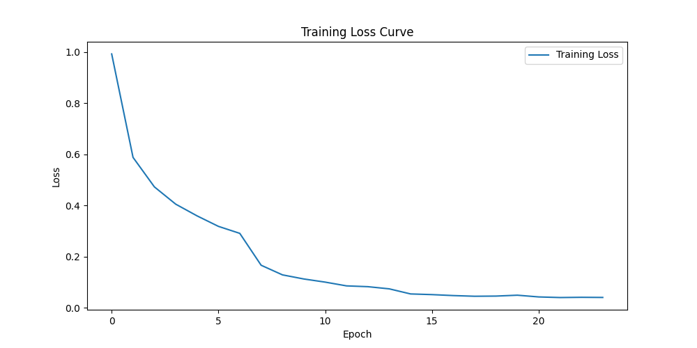
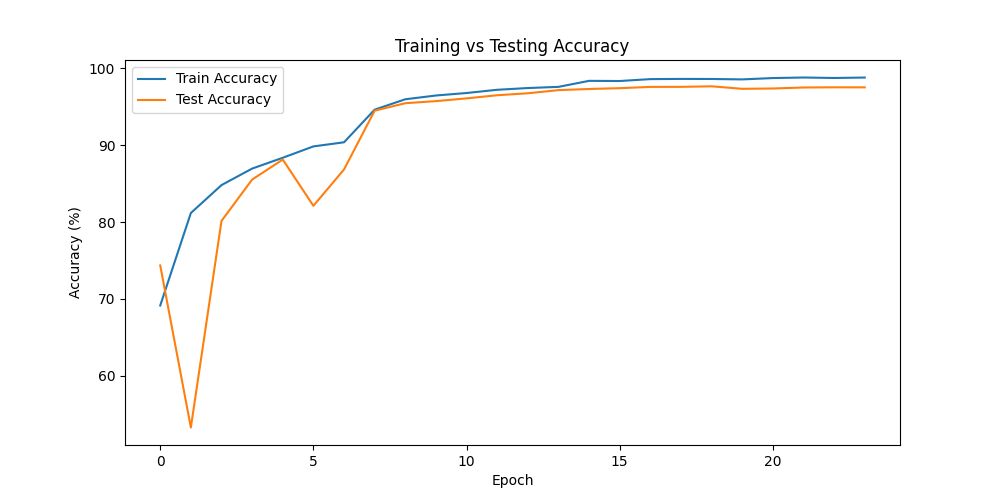
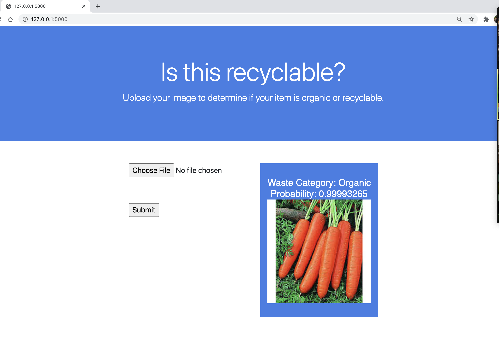

# Waste Classification Model - Multi-Class Deep Learning Project

### Background & Purpose
Recycling waste material is a huge challenge globally. This is because waste is not only challenging to sort at the human level, but it is also time consuming and often hazardous. One promising area of research and innovation that could be used to address this problem is machine learning and artificial intelligence. Using smart technology to classify waste could be a cost efficient, safe, and possibly even more accurate method of sorting large amounts of waste in a timely manner, which could thereby help to improve the recycling rate. The purpose of this project is to build a machine learning model that classifies images of waste materials into 11 different categories and provides appropriate disposal guidance.

### The Data
The dataset contains images organized into 11 waste categories:
- **biological** - Food scraps and organic waste
- **cardboard** - Cardboard boxes and packaging
- **clothes** - Textile materials and clothing
- **glass** - Glass bottles, jars, and containers
- **Hazardous** - Dangerous materials requiring special handling
- **medical** - Medical waste and supplies
- **metal** - Cans, tins, and metal objects
- **paper** - Newspapers, documents, and paper products
- **plastic** - Bottles, containers, and plastic packaging
- **shoes** - Footwear and shoe materials
- **trash** - General non-recyclable waste

The dataset is structured with train/validation/test splits and contains thousands of images across these categories.

### Model Architecture & Training
We built a deep convolutional neural network using **PyTorch** with a **ResNet-50** architecture pre-trained on ImageNet. The model was fine-tuned for our 11-class waste classification task with the following specifications:

- **Base Model**: ResNet-50 with ImageNet weights
- **Framework**: PyTorch
- **Input Size**: 224x224 RGB images
- **Output Classes**: 11 waste categories
- **Final Layer**: Fully connected layer with 11 outputs
- **Optimization**: Adam optimizer with appropriate learning rate scheduling
- **Data Augmentation**: Standard transforms including resize, normalization

The model achieved high accuracy on the validation set and demonstrates robust performance across different waste categories.





### Web Applications
We developed two Flask-based web applications for waste classification:

#### Application 1: Simple Web Interface (`index.py` + `main.py`)
- Basic HTML interface for image upload
- Uses the PyTorch ResNet-50 model for predictions
- Returns waste category and confidence score
- Simple and lightweight implementation

#### Application 2: Advanced API (`app.py`)
- RESTful API with CORS support
- Comprehensive waste management guidance
- Intelligent bin categorization:
  - **Blue Bin** (Recyclables): plastic, paper, metal, cardboard, glass
  - **Green Bin** (Compostables): biological waste
  - **Special Handling**: hazardous and medical waste
  - **General Bin**: clothes, shoes, general trash
- Educational tips and environmental impact information
- JSON response format for integration with frontend applications

Both applications use the same trained PyTorch model (`waste_classifier_final.pth`) and provide real-time waste classification with disposal recommendations.



### Conclusions
This project demonstrates the practical application of deep learning to environmental sustainability through automated waste classification. By expanding from a simple binary classification to an 11-category system, we've created a more comprehensive solution that can:

- Accurately identify different types of waste materials
- Provide specific disposal guidance for each category
- Educate users about proper recycling practices
- Support waste management facilities in automated sorting

The multi-class approach represents a significant step toward real-world deployment in waste sorting facilities, where precise categorization is crucial for effective recycling and environmental protection.

## How to run this app locally:

### Setup/Requirements:
* Python 3.8+ (required)
* Visual Studio Code (recommended)
* Chrome browser (recommended)
* See requirements.txt for all dependencies

### Installation:
```bash
# Clone the repository
git clone <repository-url>
cd waste-classification

# Install dependencies
pip install -r requirements.txt

# Note: You may need to install PyTorch separately based on your system:
# For CPU: pip install torch torchvision
# For GPU: pip install torch torchvision --extra-index-url https://download.pytorch.org/whl/cu118
```

### Project Structure:

```
waste-classification/
│   app.py                          # Advanced Flask API with CORS
│   index.py                        # Simple Flask web interface
│   main.py                         # PyTorch model inference functions
│   train.py                        # Model training script
│   utils.py                        # Utility functions
│   requirements.txt                # Python dependencies
│   waste_classifier_final.pth      # Trained PyTorch model
│   README.md                       # This file
│
├── templates/
│   └── index.html                  # HTML template for web interface
│
├── static/                         # Uploaded images storage
│   └── (uploaded images appear here)
│
├── garbage_split/                  # Training dataset
│   ├── train/
│   ├── val/
│   └── test/
│
├── Resources/                      # Project resources and documentation
│   ├── Images/                     # Charts, diagrams, screenshots
│   └── Model/                      # Model-related files
│
└── TACO/                          # Additional dataset and tools
```

### Running the Applications:

#### Option 1: Simple Web Interface
```bash
python index.py
```
- Open browser to `http://localhost:5000`
- Upload an image using the "Choose File" button
- Click "Submit" to get classification results

#### Option 2: Advanced API
```bash
python app.py
```
- API endpoint: `POST http://localhost:5000/predict`
- Send images via form-data with key "file"
- Returns JSON with detailed classification and disposal guidance

### Usage Examples:

#### API Response Format:
```json
{
    "waste_type": "plastic",
    "confidence": 94.23,
    "category": "Recyclable",
    "bin": {
        "name": "Blue Bin",
        "color": "#007BFF",
        "icon": "recycle"
    },
    "recyclable": true,
    "tip": "Bottles, wrappers, and containers go in dry waste.",
    "reason": "Recycling plastic reduces pollution."
}
```

### Model Files:
- `waste_classifier_final.pth` - Final trained model
- `waste_classifier_epoch10.pth` - Checkpoint at epoch 10
- `waste_classifier_epoch20.pth` - Checkpoint at epoch 20
- `best_waste_classifier.pth` - Best performing model during training

### Key Dependencies:
- **PyTorch & torchvision** - Deep learning framework
- **Flask** - Web application framework
- **Flask-CORS** - Cross-origin resource sharing
- **Pillow (PIL)** - Image processing
- **NumPy** - Numerical computations

### Waste Categories Supported:
1. **Biological** - Food scraps, organic matter
2. **Cardboard** - Boxes, packaging
3. **Clothes** - Textiles, fabric materials
4. **Glass** - Bottles, jars, containers
5. **Hazardous** - Dangerous chemicals, electronics
6. **Medical** - Healthcare waste, supplies
7. **Metal** - Cans, tins, metal objects
8. **Paper** - Documents, newspapers
9. **Plastic** - Bottles, containers, packaging
10. **Shoes** - Footwear materials
11. **Trash** - General non-recyclable waste

### Environmental Impact:
This system promotes proper waste disposal by:
- Educating users about recyclable vs non-recyclable materials
- Providing specific disposal instructions for each waste type
- Reducing contamination in recycling streams
- Supporting automated waste sorting facilities
- Contributing to overall environmental sustainability

---

**Note**: Ensure you have the trained model file (`waste_classifier_final.pth`) in the project root directory before running the applications. The model file should be available in the project repository or can be generated by running the training script with the appropriate dataset.
